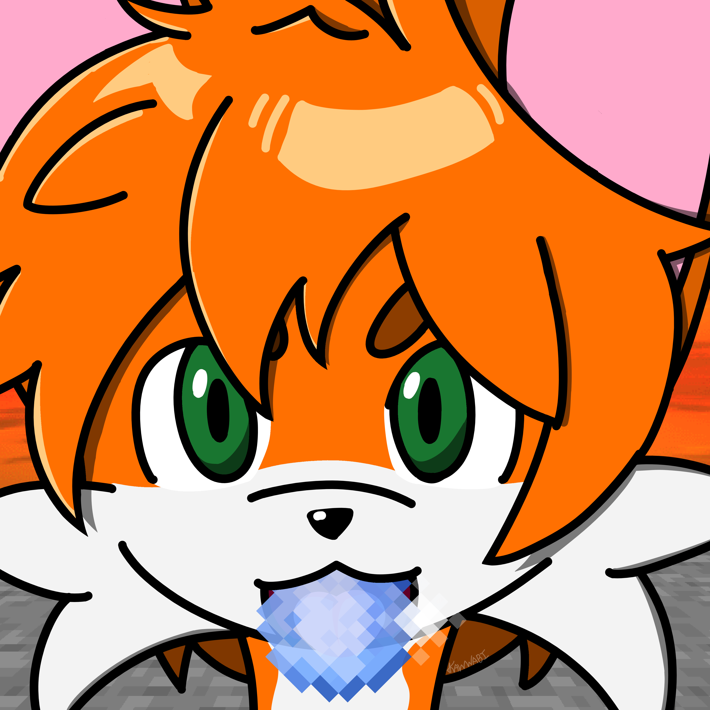

  

  # ⎯ Klassic Orange PvP ⎯

  **A vibrant PvP texture pack for multiple Minecraft versions (highly recommended for 1.8.9!).**

  

    
    
    
  

---

This texture pack was designed to recreate the feeling Minecraft gave me as a child. Back then, everything seemed more vibrant and interesting. I wanted to bring that magic back, so here's my pack!

I started with a biological concept in mind: The color receptors in children's eyes are fresh, allowing them to process a wider visual range, which gives them the feeling of seeing the world with more color (aka, more saturation, since there's a wider color range). I used that idea as the core inspiration here, tweaking the colors and contrasts to replicate that feeling for me, I hope it also suits you, too.

## About the Assets

To make this vision a reality, this pack combines my own custom textures, Minecraft's newer version's textures, edited vanilla Minecraft assets, and some open-source community contributions, including adapted backported textures and a custom cubemap to get a cool sunset.

---

### License & Credits

This work is a derivative of <a href="https://github.com/backporteverything/Backport-Everything">Backport Everything</a> by samfortyseven, used under CC BY-SA 4.0. This modified version is licensed under CC BY-SA 4.0 by Kawwabi. To view a copy of this license, visit http://creativecommons.org/licenses/by-sa/4.0/

**Note:** Any vanilla Minecraft assets included in this pack remain the copyright of Mojang Studios and are NOT licensed under CC BY-SA 4.0.

* **xokz and MiffenKop:** Creators of the Connected Textures Overhaul, which I adapted to 1.8.9 and added the texture to my own.
* **Screaming Brain Studios:** For making the cubemap that I edited and adapted for Minecraft.
* **Shade:** Creator of the texture I based my tools in.
* **samfortyseven:** Creator of the Backport Everything texture that helped me a lot in getting some of the textures properly backported.
* The other textures in this pack are my own creations or from Minecraft 26.2 itself, although most of them are slightly edited.